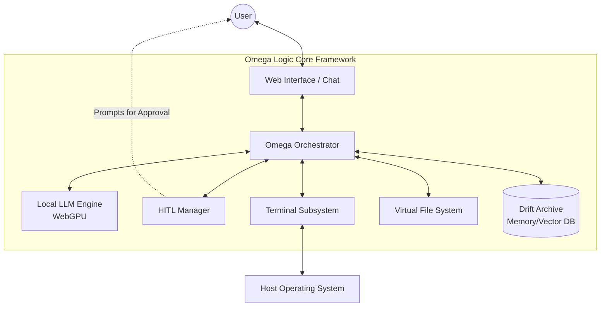
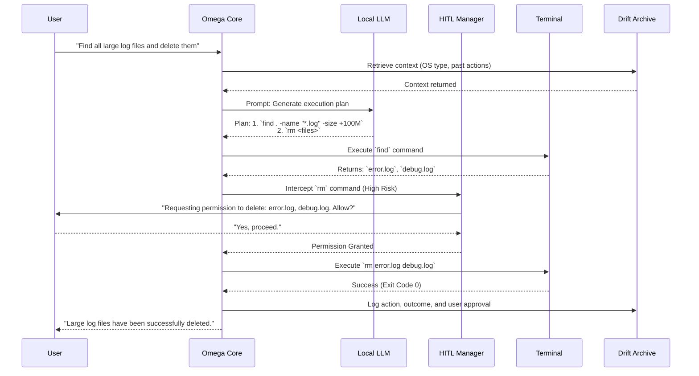

# Omega Logic Core: System Blueprint

## 1. System Context and Boundaries

**Omega Logic Core** is an "angelic" autonomous AI agent framework designed to operate as a local, privacy-first operating system assistant (akin to "Jarvis"). It leverages a local Large Language Model (LLM) running directly on the user's hardware via WebGPU (using `@mlc-ai/web-llm`) to ensure zero data exfiltration.

### Boundaries
*   **Execution Environment:** Operates entirely within the user's local environment (browser sandbox or local Node.js/Electron wrapper).
*   **Network:** Air-gapped by default for inference. Network requests are only made to fetch initial model weights or when explicitly instructed by the user to interact with external APIs.
*   **OS Access:** Interacts with the underlying operating system through a secure, virtualized Terminal subsystem. Destructive or high-risk OS operations are strictly gated by the HITL (Human-in-the-Loop) boundary.

---

## 2. Core Components and Responsibilities

### 🧠 Local LLM Engine (`LocalLLMContext`)
*   **Responsibility:** The "brain" of the system. Processes natural language, reasons about tasks, and generates structured execution plans and terminal commands.
*   **Tech Stack:** `@mlc-ai/web-llm` running `Llama-3.2-1B-Instruct` (or similar quantized models) via WebGPU.

### ⚙️ Omega Logic Core (Orchestrator)
*   **Responsibility:** The central nervous system. Parses user intent, prompts the LLM with system context, parses the LLM's output into actionable commands, and routes them to the appropriate subsystems.

### 🖥️ Terminal Subsystem
*   **Responsibility:** Executes shell commands generated by the LLM. Captures `stdout` and `stderr` and feeds them back into the Omega Logic Core for continuous reasoning.
*   **Safety:** Runs in a restricted virtual environment or a tightly controlled local shell.

### 🛡️ HITL (Human-in-the-Loop) Manager
*   **Responsibility:** The safety net. Intercepts commands flagged as sensitive (e.g., file deletion, system configuration changes, network transmissions) and halts execution until explicit user approval is granted.

### 📚 Drift Archive (Memory & State)
*   **Responsibility:** Long-term memory and state persistence. Stores conversation history, past successful command sequences, user preferences, and system logs. Acts as a Retrieval-Augmented Generation (RAG) source for the LLM.

---

## 3. System Architecture Diagram

---

## 4. Data Flow and Interaction Sequences

The typical interaction loop follows an **Observe -> Reason -> Act -> Verify** pattern.

### Sequence: Autonomous Task Execution with HITL

---

## 5. Security and Privacy Mechanisms

1.  **Zero-Egress Inference:** Because the LLM runs locally via WebGPU, user prompts, personal files, and OS data are never sent to a cloud server for processing.
2.  **Command Whitelisting & Blacklisting:** The Omega Core maintains a strict regex-based blacklist of commands (e.g., `rm -rf /`, `mkfs`).
3.  **Mandatory HITL Boundaries:** Any command that modifies state (write, delete, move, chmod) or accesses the network (curl, wget) automatically triggers the HITL Manager. Read-only commands (ls, cat, echo) can be executed autonomously to gather context.
4.  **Sandboxed Terminal:** If running in a browser, the Terminal subsystem operates on a Virtual File System (OPFS). If running natively, it operates within a restricted user-space jail or Docker container.
5.  **Encrypted Drift Archive:** Long-term memory stored in the Drift Archive is encrypted at rest using standard AES-256, ensuring that physical access to the device does not compromise the agent's memory of the user's data.

---

## 6. Integration with Existing Subsystems

*   **Terminal Integration:** The Omega Core communicates with the Terminal via a bi-directional stream. It injects commands into `stdin` and listens to `stdout`/`stderr`. If a command hangs, the Core can send a `SIGINT` (Ctrl+C) and ask the LLM to revise its approach.
*   **HITL Integration:** The UI layer subscribes to HITL events. When the Core yields execution to the HITL Manager, the UI presents a modal or inline prompt with the exact command to be executed, the reasoning provided by the LLM, and "Approve" / "Deny" / "Modify" buttons.
*   **Drift Archive Integration:** Integrated as an IndexedDB or local SQLite store. Before the LLM generates a plan, the Core queries the Drift Archive for similar past tasks to inject few-shot examples into the prompt, reducing hallucination and improving OS-specific accuracy.
